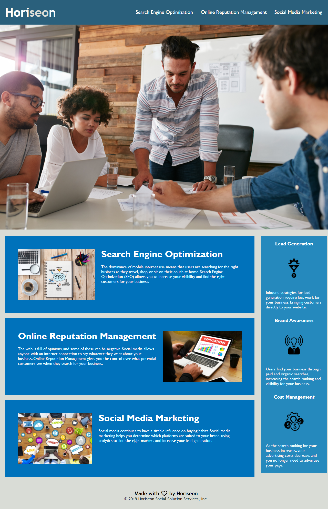

# Horiseon

*Horiseon is a social solution services company that providers customers with a range of services including Sear5ch Engine Opitimization, Online Repuation Mangement, and Social Media Marketing*

## Technologies Used

The following technologies were used to create this page.

* HTML
* CSS

## Website

https://alex-kress.github.io/Horiseon/

## Project Description

This website was created using CSS to format and provide styling for the HTML code that is the structure of the website.

The website and its code starts with a header that has links that navigate the user to a "Content" section that contains a description of the services that Horiseon offers its customers.

The header is followed by a Hero section, the above-mentioned "Content" section, a second section of content labeled "Benefits" that describes some of the benefits for customers who work with Horiseon, and ends with a footer.

The HTML and CSS coding in the project has been written using semantic HTML elements and organized, consolidated CSS selectors and properties, to allow for ease of use and editing in the future.

